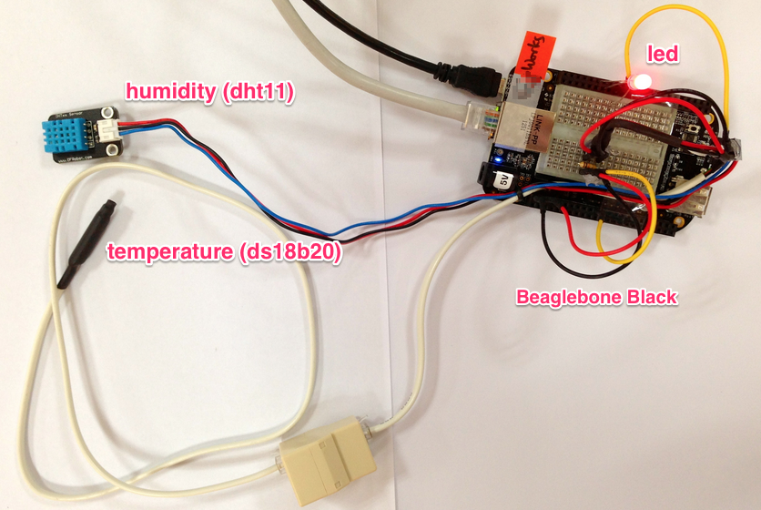

# sensorjs

This module handles all about sensor with powerful and familiar techs.
In other words this sensorjs is not only sensor driver module but also framework like express.
And it's working model as shown below.



## Install

 npm install sensorjs 

## Quick example

```javascript
var sensor = require('sensorjs').sensor;

sensor.discover('oneWire', function (err, ids) {
  ids.forEach(function (id) {
    var thermometer = sensor.createSensor('ds18b20', id);

    thermometer.get(function (err, data) {
      if (!err) {
        console.log(data);
      } 
    });
  });
});
```

There are more [examples](https://github.com/daliworks/sensorjs/tree/master/example).

===
by [@sensorjs](https://twitter.com/sensorjs)
